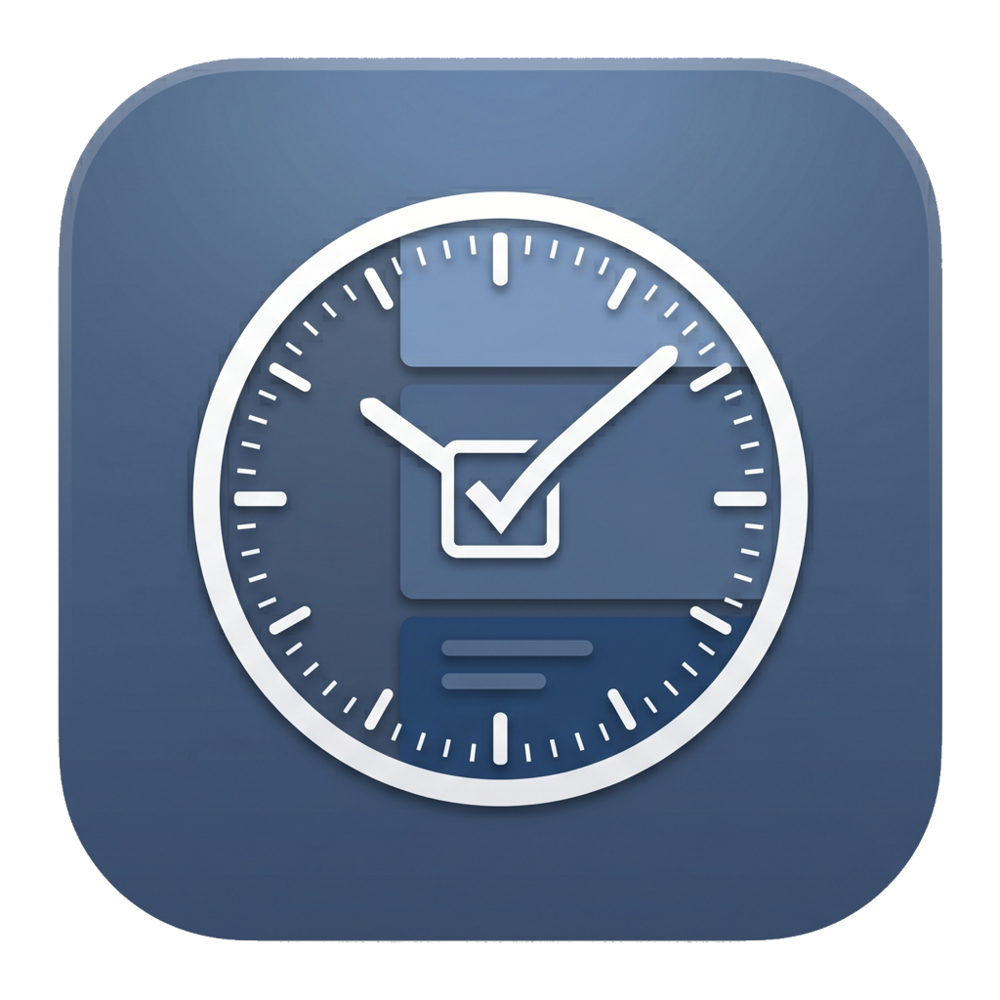

<p align="center">
  
</p>

<h1 align="center">Brain Dump</h1>

<p align="center">
  A focused macOS day planner modeled on the <em>Harvard Business Review</em> Daily Timebox.<br />
  Each day is a single sheet — <strong>Brain Dump</strong>, <strong>Top 3</strong>, and an hour-blocked <strong>Schedule</strong> — and whatever you don't finish rolls forward to tomorrow.
</p>

---

## What it is

Brain Dump turns the paper "Daily Timebox" worksheet into a native macOS app. You capture everything on your mind in the **Brain Dump**, pull the three things that matter into **Top Priorities**, then **time-block** them onto an hourly schedule. Anything still open at day's end reappears in tomorrow's brain dump, so nothing slips through. The app is a three-pane sidebar shell — **Today**, **Tasks**, and **Backlog** — with **Settings** in the footer.

---

## Highlights

- **One sheet per day** — Top 3, Brain Dump, and an hourly Schedule, side by side.
- **Automatic rollover** — unfinished items move to today; completed days are kept as history.
- **Drag-and-drop time-blocking** — drag a task onto the schedule or into a priority slot.
- **8-color schedule blocks** with conflict detection and one-tap completion.
- **Full task search** — keyword + tag + completion-date filters across every day.
- **Backlog** — a parking lot for "later" tasks, promoted into a day when you're ready.
- **Tags & notes** on every task, with autocomplete from your existing tags.
- **Local reminders** — per-block schedule notifications and a daily backlog-age digest.
- **JSON backup** — export/import everything; **Clear Data** wipes content but keeps your settings.
- **Never loses data on launch** — a corrupt store is preserved and the app recovers automatically.
- **Neo-Academic design** — deep navy + crimson, Hanken Grotesk + Source Serif 4, thin borders.

---

## Keyboard shortcuts & gestures

| Shortcut | Action                  | Where                              |
| -------- | ----------------------- | ---------------------------------- |
| **⌘1**   | Go to Today             | Anywhere                           |
| **⌘2**   | Go to Tasks             | Anywhere                           |
| **⌘3**   | Go to Backlog           | Anywhere                           |
| **⌘B**   | Show / hide the sidebar | Anywhere                           |
| **⌘N**   | New brain-dump task     | Today, on editable (non-past) days |
| **⌘N**   | New backlog task        | Backlog screen                     |

Standard macOS shortcuts apply via the menu bar (**⌘Q**, **⌘W**, **⌘M**, **⌘H**).

| Gesture                                       | Action                                         |
| --------------------------------------------- | ---------------------------------------------- |
| **Drag** a brain-dump row → **schedule slot** | Open the Time Block sheet to time-block it     |
| **Drag** a brain-dump row → **Top-3 slot**    | Promote it to a priority (swap prompt if full) |
| **Drag** a priority → **another slot**        | Reorder / swap priorities                      |
| **Drag** a priority → **brain-dump area**     | Demote it back to the brain dump               |
| **Click** the date header                     | Open the month calendar                        |
| **Hover** a row / block                       | Reveal edit / delete / complete actions        |

---

## Requirements

- **macOS 14 (Sonoma) or later**

## Build & run

Day-to-day development happens in Xcode:

```bash
xed BrainDump.xcodeproj      # open in Xcode; ⌘R builds, runs, and debugs the app
```

Headless build + launch, or package a distributable DMG:

```bash
./scripts/run-app.sh                 # xcodebuild build + open BrainDump.app
CONFIG=Release ./scripts/run-app.sh  # Release build
./scripts/build-dmg.sh               # Release .app → unsigned .dmg (needs: brew install create-dmg)
```

The `BrainDumpKit` library and its tests build with SwiftPM:

```bash
swift build                  # build BrainDumpKit
swift test                   # run all tests
swift test --filter <name>   # run a single test (substring match on the @Test name)
```

---

## Privacy

Brain Dump is **fully local**. There is no account, no sync, and no network access — your data stays in the on-disk store and in any JSON backups you export yourself.
